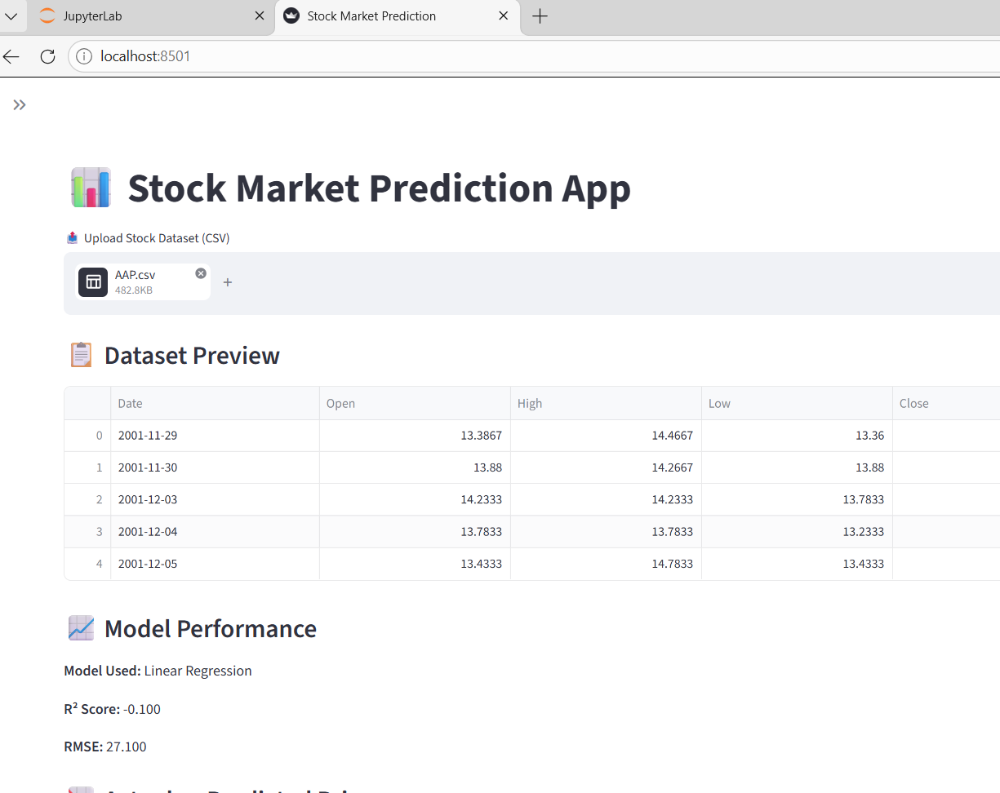
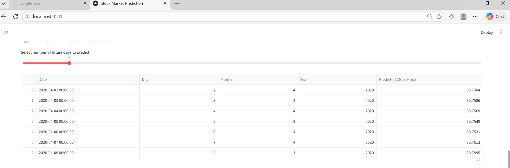
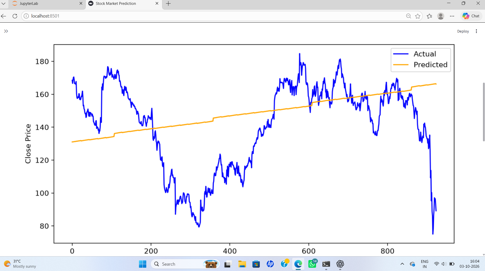
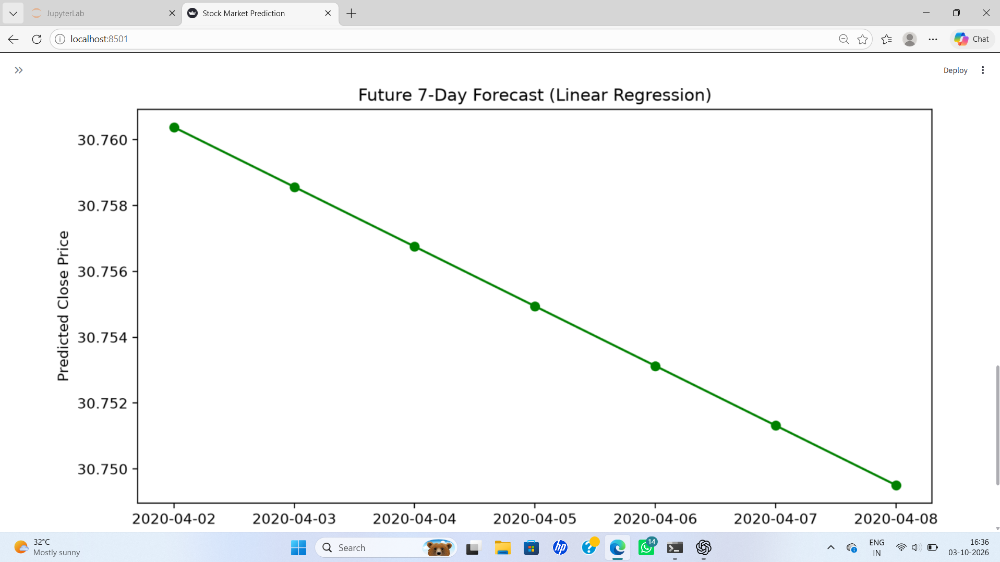
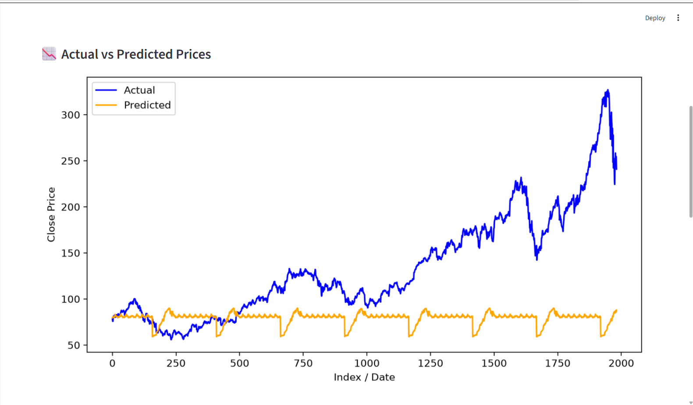
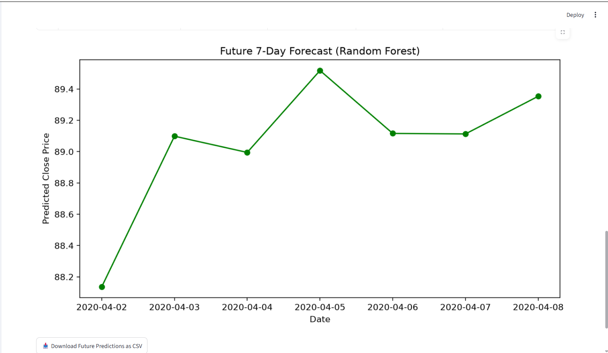

# stock-market-prediction
Stock Market Prediction using Machine Learning and Python
# 📈 Stock Market Prediction

## 📌 Project Overview

Stock Market Prediction is a machine learning and deep learning based project developed to analyze historical stock market data and predict future stock prices.

The project implements multiple machine learning models and provides an interactive Streamlit web application for stock prediction and visualization.

---

## 🎯 Objectives

- Analyze historical stock market data
- Perform data preprocessing and feature preparation
- Visualize historical stock prices
- Apply machine learning algorithms for prediction
- Apply LSTM deep learning for time-series prediction
- Forecast future stock prices
- Provide an interactive user interface using Streamlit

---

## 🚀 Features

- 📊 Historical stock data analysis
- 📈 Stock price visualization
- 🤖 Linear Regression prediction
- 🌲 Random Forest prediction
- 🧠 LSTM Deep Learning prediction
- 🔮 Future stock price forecasting
- 📁 CSV data upload
- 🌐 Interactive Streamlit application
- 📓 Jupyter Notebook for model development

---

## 🛠️ Technologies Used

### Programming Language
- Python

### Libraries and Frameworks
- Pandas
- NumPy
- Matplotlib
- Scikit-learn
- TensorFlow
- Keras
- Joblib
- Streamlit
- yFinance

### Development Tools
- JupyterLab
- GitHub
- VS Code / Python IDE

---

## 🤖 Machine Learning Models

### 1. Linear Regression

Linear Regression is used as a basic machine learning approach to predict stock prices using historical features.

### 2. Random Forest

Random Forest is used to model nonlinear relationships in historical stock market data.

### 3. LSTM

Long Short-Term Memory (LSTM) is a deep learning architecture designed for sequential and time-series data.

The LSTM model learns patterns from historical stock prices and is used to predict future values.

---

## 📊 Input Data

The application works with historical stock market data.

Important columns include:

- `Date`
- `Close`

The historical data is processed before being provided to the prediction models.

---

## 📂 Project Structure

```text
stock-market-prediction/
│
├── stock.py
├── Stock Market Prediction.ipynb
├── dataset.csv
├── stock_lstm_model.keras
├── stock_scaler.pkl
├── requirements.txt
└── README.md

## 📸 Streamlit Application Output

The Stock Market Prediction App provides predictions using three machine learning approaches:

### 1. Linear Regression

Linear Regression is used to predict stock closing prices based on date-related features.










### 2. Random Forest

Random Forest Regression is used to model nonlinear relationships and predict stock prices.







### 3. LSTM Deep Learning

LSTM (Long Short-Term Memory) is used for time-series stock price prediction.


